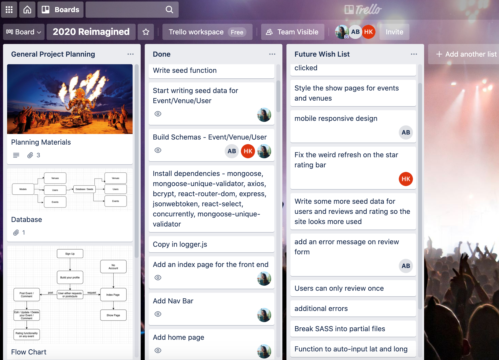
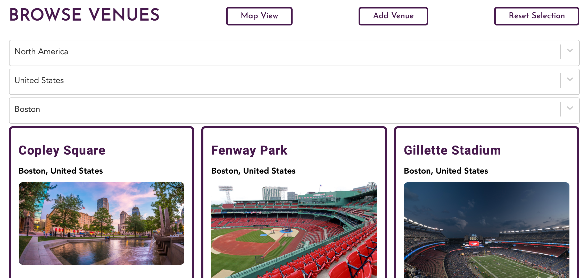
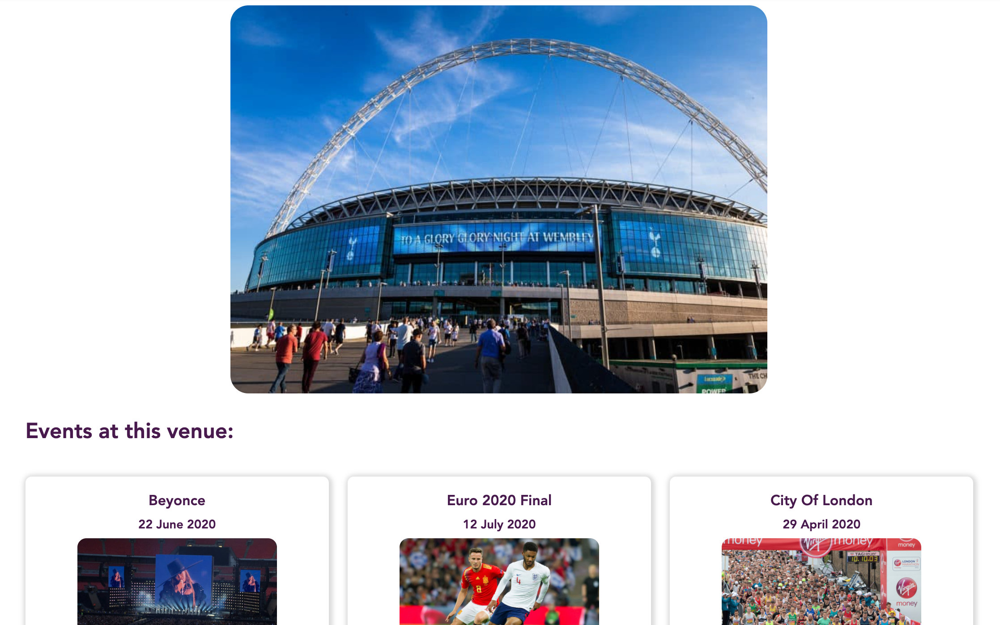
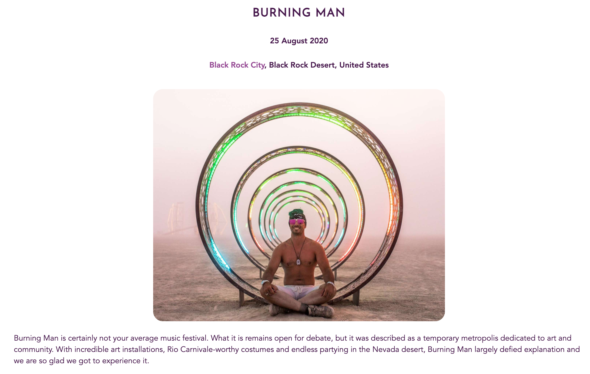
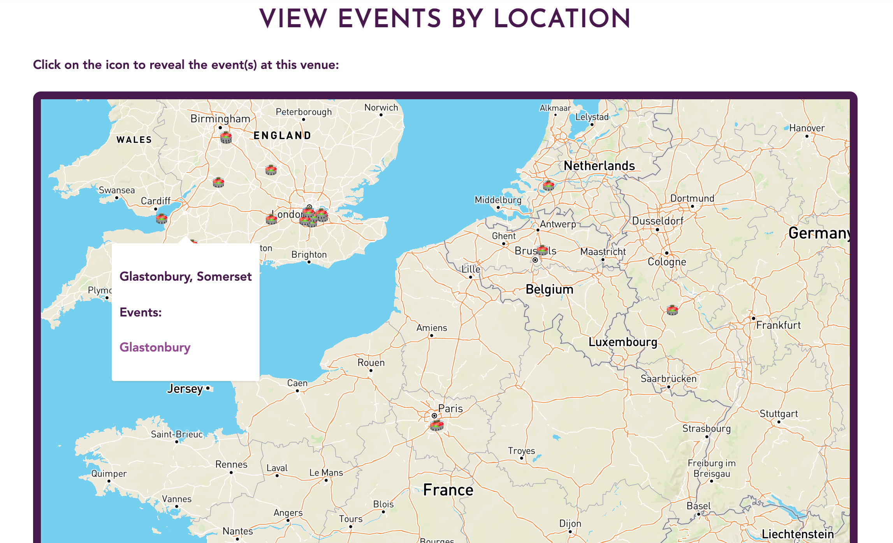
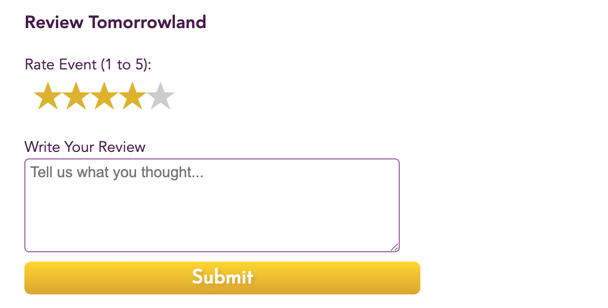

# 🎉 2020 Reimagined - A Fullstack MERN App

A one-week group project for General Assembly’s Software Engineering Immersive course, built using React, Express, Mongo, and Node.

### Developed by:
* Aislin Bamber - https://github.com/aislinb

* Hugo Kinahan -  https://github.com/hugokinahan

* Penny Jungreis - https://github.com/penelopecj


## Deployment
This website has been deployed on Heroku and is available _here._ Please feel free to register your own account, or you can use mine `penny@email` and password `pass`.

## Concept
2020 Reimagined is a site where users can browse the awesome events that happened in 2020 in an imaginary world where there was never a pandemic.

In an alternate reality, thousands of people attended events across the world in 2020 living their best lives. Users can let us know what their 2020 selves thought as they partied, celebrated, and travelled to these incredible events.

## Project Brief
* One week to plan, build, and test our most advanced project to date with achievable scope and a focus on creating a professional finished product.
* Make it a full-stack application by making our own backend and frontend.
* Use an Express API to serve our data from a Mongo database.
* Consume our API with a separate frontend built with React.
* Be a complete product with multiple relationships and CRUD functionality for multiple models.
* Implement thoughtful user stories/wireframes for MVP and additional features.
* Have a visually impressive design.

## Technologies Used
* Backend:
  * MongoDB
  * Node.js
  * Express
* Frontend:
  * JavaScript (ES6)
  * React.js
  * HTML5
  * CSS3 + SASS
* Dependencies:
  * Axios
  * react-router-dom
  * react-select
  * react-hero-carousel
  * react-spinners
  * JSONWebToken
  * bcrypt
  * mongoose-unique-validator
* Development Tools:
  * VS Code
  * Git + GitHub
  * Insomnia
  * Mapbox
  * Cloudinary
 
## Installation Instructions
1. Clone repo code from GitHub onto your machine.
2. Use `yarn` or `npm` to install all dependencies from the `package.json` file.

## User Stories & Wireframes
**Backend Wireframe**


**Frontend Wireframe**


## General Approach & Planning



### Group Work
* The three of us worked together to plan out our Minimum Viable Poduct using Trello.
* We divided up the tasks needed to set up the backend and took turns writing seed data to populate the site.
* We used Trello, Slack, Zoom, and GitHub to communicate who was responsible for what and when things had been completed. Good communication was essential for this project so we would not overwrite any changes from another group member and could handle git branch conflicts easily when they arose.
* We finished our backend in the first two days of the project and then moved on to assigning React components for each of us to do.
* We helped each other to resolve any errors or bugs at the start of each day after our daily standup on Zoom.
* We made all major decisions about site styling, colours, and Google Fonts together.
* We worked together across the site to add error handling and error messages for the UI.

**Controllers for RESTful routes:**
```
async function eventIndex(_req, res, next) {
  try {
    const events = await Event.find()
      .populate('venue')
      .populate('owner')
      .populate('comments.owner')
    return res.status(200).json(events)
  } catch (err) {
    next(err)
  }
}

async function eventCreate(req, res, next) {
  try {
    const newEventData = { ...req.body, owner: req.currentUser._id }
    const newEvent = await Event.create(newEventData)
    return res.status(201).json(newEvent)
  } catch (err) {
    next(err)
  }
}

async function eventShow(req, res, next) {
  const { id } = req.params
  try {
    const event = await Event.findById(id).populate('venue').populate('owner').populate('comments.owner')
    if (!event) throw new Error(notFound)
    return res.status(200).json(event)
  } catch (err) {
    next(err)
  }
}

async function eventUpdate(req, res, next) {
  const { id } = req.params
  try {
    const eventToEdit = await Event.findById(id)
    if (!eventToEdit) throw new Error(notFound)
    if (!eventToEdit.owner.equals(req.currentUser._id)) throw new Error(forbidden)
    Object.assign(eventToEdit, req.body)
    await eventToEdit.save()
    return res.status(202).json(eventToEdit)
  } catch (err) {
    next(err)
  }
}

async function eventDelete(req, res, next) {
  const { id } = req.params
  try {
    const eventToDelete = await Event.findById(id)
    if (!eventToDelete) throw new Error(notFound)
    if (!eventToDelete.owner.equals(req.currentUser._id)) throw new Error(forbidden)
    await eventToDelete.remove()
    return res.sendStatus(204)
  } catch (err) {
    next(err)
  }
}
```

### My Work
* I focussed on the Index pages, including the location filter selector and responsive design.


```
let cities = []

venues.map(venue => {
  cities.push(venue.city)
})

function removeDuplicates(data) {
  const unique = []
  data.forEach(element => {
    if (!unique.includes(element)) {
      unique.push(element)
    }
  })
  return unique
}

cities = removeDuplicates(cities)

const filteredCities = []
cities.map(city => {
  filteredCities.push({ value: city, label: city })
})

const handleSelectCity = (e) => {
  const results = venues.filter(venue => {
    return venue.city === e.value
  })
  setVenues(results)
}
```

* I worked on the Show pages, including the display of events at each venue.



* I handled the JavaScript date manipulation on all events and reviews.
```
const jsDate = new Date(date)
const day = jsDate.getDate()
let month = jsDate.getMonth()
const months = ['January', 'February', 'March', 'April', 'May', 'June', 'July', 'August', 'September', 'October', 'November', 'December']
month = months[month]
const year = jsDate.getFullYear()
```



* The reviews and average rating frontend, complete with date stamp and profile photo.
```
const stars = []
for (let i = 0; i < event.avgRating; i++) {
  stars.push('★')
}
```

* I worked on the nav bar, with responsive-sizing, re-load on login and logout, subtle hovers, and logo.


* I worked on the event, venue, and review 'delete' features.
* I built the Edit form on venues and events.
* I created the static footer.
* I chose the brand purple colour for site and VS Code.

### My Teammates' Work
* The map view page, which shows the exact latitude and longitude of each event using Mapbox.
* Popups on each venue on the map displaying the events at that venue.



* The Profile page and edit form.
* The profile photo upload feature.
* The login and registration forms.
* The awesome photo slider and text animations on the homepage.
* The highest-rated events (frontend).
* The average rating calculator (backend).
```
eventSchema.virtual('avgRating').get(function() {
  if (!this.comments.length) return 'Not rated yet'
  const avg = this.comments.reduce((sum, curr) => {
    return sum + curr.rating
  }, 0)
  return Math.round(avg / this.comments.length)
})
```

## Wins
* The stylish star-rating bar on the review forms.



* Cohesive and professional styling across the whole site.
* Eye-catching homepage with animations.
* Learnt to use *react-select* to filter by continent, country, and city.
* When the user adds a new venue and event at that venue, it will display on the map view as well.
* Collaboration - this was the dream team and we got so much more done together than I could have done by myself.


## Challenges
* Learning to use group Git for the first time and handling merge conflicts.
* Handling user authentication to ensure that only the creator of an event or review would be allowed to edit or delete it.
```
import jwt from 'jsonwebtoken'
import { secret } from '../config/environment.js'
import User from '../models/user.js'

export default async function secureRoute(req, res, next) {
  try {
    if (!req.headers.authorization) {
      throw new Error('Missing Required Header') 
    } //no authorization key 

    const token = req.headers.authorization.replace('Bearer ', '') // attempt made to get token 
    const payload = jwt.verify(token, secret) // verifying token. id will be here on key of sub
    const userToVerify = await User.findById(payload.sub) // finding the user attributed to token 

    if (!userToVerify) {
      throw new Error('User not Found')
    }

    req.currentUser = userToVerify // currentUser is made up but this is the user found on the token. 

    next()

  } catch (err) {
    console.log('🤖 Authorization Error', err.name, err.message)
    return res.status(401).json({ message: 'Unauthorized' })
  }
}
```

## Unsolved Problems
* The default values do not clear from the filter selectors on the Index pages.
* Browser refreshes when the user selects the star rating on the review form.
* Review form does not display error message for missing info.
* Bug with venue review delete function.

## Feature Wish List
* Users can edit their reviews.
* Limit the top-rated events to only display top three.
* Nav bar hamburger menu for a mobile phone screen.
* Auto-calculate and input the latitude and longitude when user creates a new venue.
* Search bar for writing in venue or event name.
* Search events by month.

✨ ***PRs welcome!*** ✨